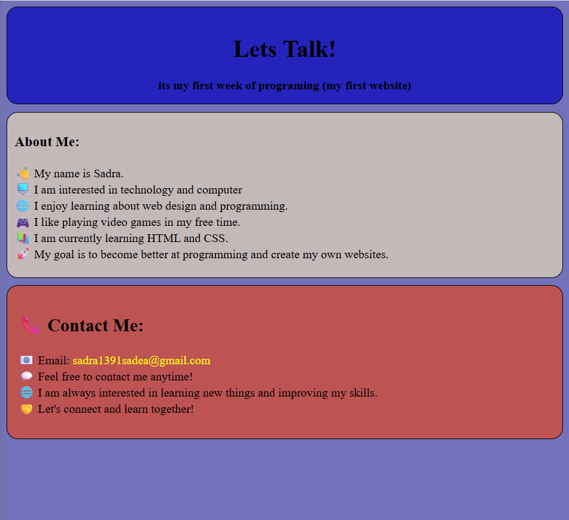

# my-first-website-html-css

# My First Website

This is my first website project, created while learning web development.

## Technologies

* HTML
* CSS

## About

This project was created to practice the basics of HTML and CSS and improve my web development skills.

## Features

* Simple and clean design
* HTML structure
* CSS styling
* Responsive layout

## Preview

You can see the live website here:

**[Live Demo](https://sadra1391sadea-arch.github.io/my-first-website-html-css/)**

## Author

Created by me as my first web development project.

## Support

I’d be happy if you supported me by giving this project a star! 
